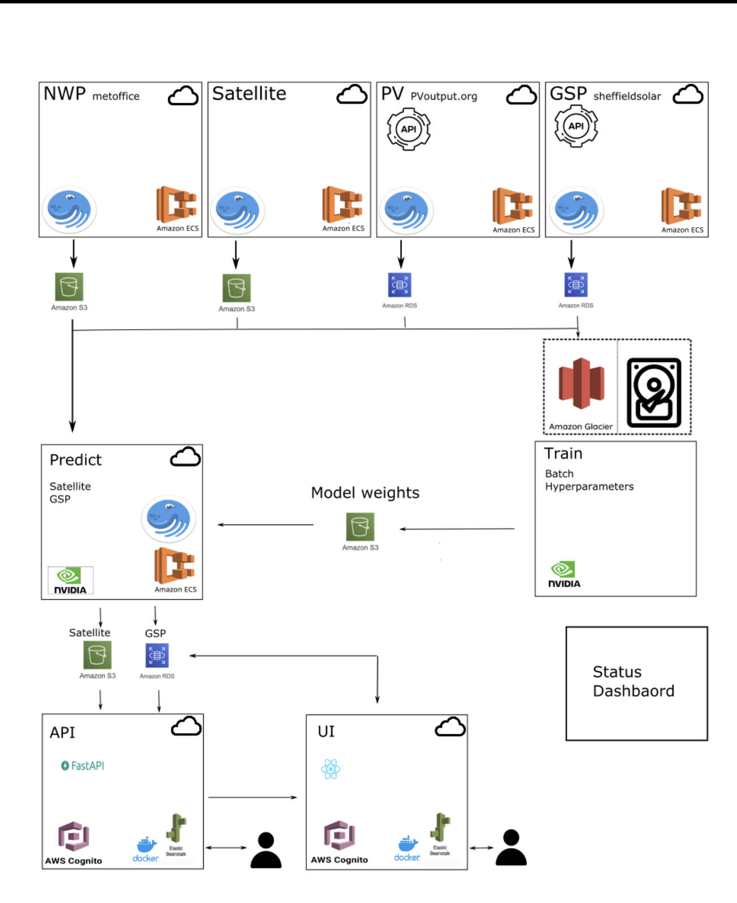

# Nowcasting Infrastrucutre
<!-- ALL-CONTRIBUTORS-BADGE:START - Do not remove or modify this section -->
[](#contributors-)
<!-- ALL-CONTRIBUTORS-BADGE:END -->

This repo contains 'infrastructure as code' for the 'Nowcasting' project.



## Terraform

The [terraform](https://learn.hashicorp.com/terraform) folder contains code inorder to deploy various services to AWS.

### Install

If you aren't on Mac or don't want to use Brew,
[check out the official terraform installation instructions](https://learn.hashicorp.com/tutorials/terraform/install-cli#install-terraform).

To install terraform run
```bash
brew tap hashicorp/tap
brew install hashicorp/tap/terraform
```

## Contributors ✨

Thanks goes to these wonderful people ([emoji key](https://allcontributors.org/docs/en/emoji-key)):

<!-- ALL-CONTRIBUTORS-LIST:START - Do not remove or modify this section -->
<!-- prettier-ignore-start -->
<!-- markdownlint-disable -->
<table>
  <tr>
    <td align="center"><a href="https://github.com/peterdudfield"><br /><sub><b>Peter Dudfield</b></sub></a><br /><a href="https://github.com/openclimatefix/nowcasting_infrastructure/commits?author=peterdudfield" title="Code">💻</a></td>
  </tr>
</table>

<!-- markdownlint-restore -->
<!-- prettier-ignore-end -->

<!-- ALL-CONTRIBUTORS-LIST:END -->

This project follows the [all-contributors](https://github.com/all-contributors/all-contributors) specification. Contributions of any kind welcome!
