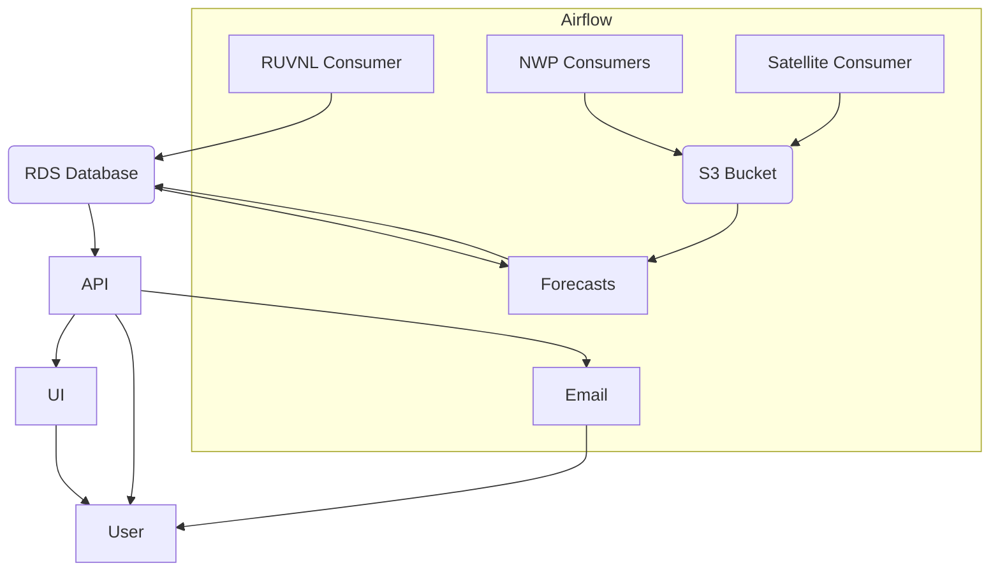

# India Solar and Wind (Development)

This folder specifies all relevant components to run this project on AWS.
All resources are specified in Terraform. By using Terraform anybody can run this script themselves.

## Setup

Install the terraform cli: https://learn.hashicorp.com/tutorials/terraform/install-cli. 
Initialize terraform by running `terraform init` in this directory.

## Configuration

The configuration options are specified in `variables.tf`.

## System Diagram

## Infrastructure

### RUNVNL Consumer

This consumer pulls data from the Rajasthan Urja Vikas Nigam Limited (RUVNL) website.

### NWP Consumers

These consumers pull NWP data from various sources.

### Satellite Consumer

This consumer pulls satellite data from IOPS

### Forecasts

This runs the forecast service and saves the result to the database

### API

The API serves the generation and forecast values to the UI, the Email service and other users.

### UI

The UI is a simple web app that shows the generation and forecast values.

### Email

An Email service that sends out regular emails to users.