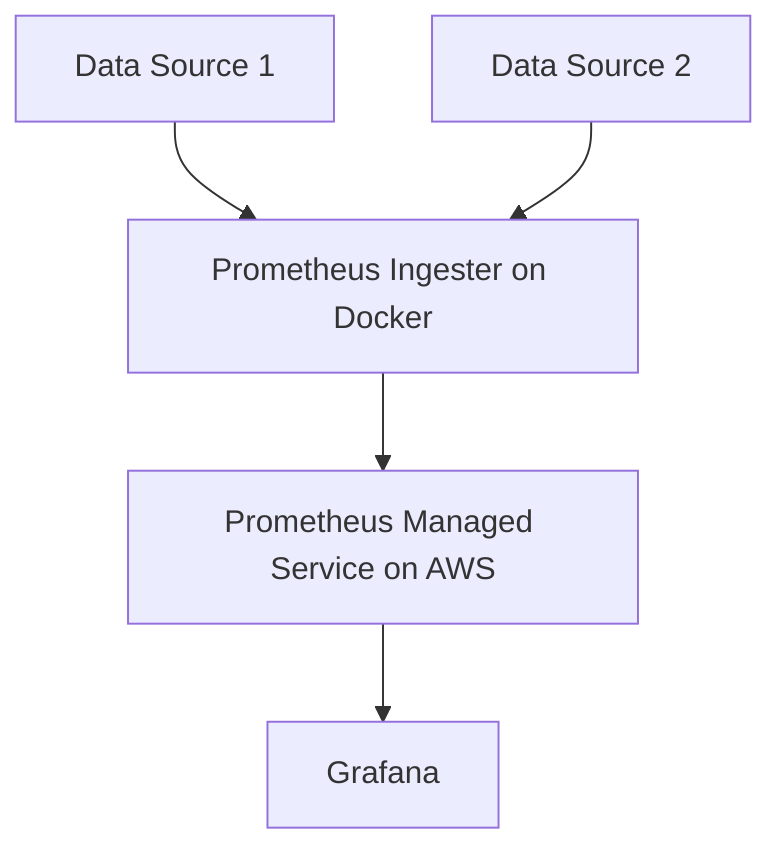

# Status Dashboard

This module helps with monitoring and contains the internal status dashboard for Nowcasting.

```mermaid
  graph TD;
      A[Data Source 1]-->B[Prometheus Ingester on Docker];
      E[Data Source 2]-->B[Prometheus Ingester on Docker];
      B[Prometheus Ingester on Docker]-->C[Prometheus Managed Service on AWS];
      C[Prometheus Managed Service on AWS]-->D[Grafana];
```
