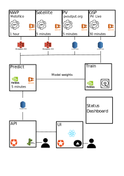

# Nowcasting Infrastructure

Contains all the infrastructure as code for the nowcasting domain.

## Folder structure

The subfolders specify the two environments for the nowcasting domain:

```yaml
nowcasting:
  development: # This is for development purposes, eg trying new things out. It is not meant to be up 100% of the time.
  production: # The production environment
```

##  Environment Architecture




There are several components to the system:
### ☁️ NWP: 
Gets the latest NWP data from the UK Met Office and saves the data to S3. This is run on ECS and is triggered by airflow. This is currently part of the `nowcasting` project. There are currently two different orders. 
- The first gets data for the next 12 hours with the following variables: `dlwrf`, `dswrf`, `hcc`, `lcc`, `mcc`, `prate`, `r`, `sde`, `si10`, `t`, `vis` .
- The second gets data for the next 42 hours with the following variables:  `dswrf` `lcc` `sde` `t` `wdir10`

More details:
   - code: [nwp-consumer](https://github.com/openclimatefix/nwp-consumer)
   - [Terraform](https://github.com/openclimatefix/ocf-infrastructure/tree/main/terraform/modules/services/nwp) 
and [Airflow Dag](https://github.com/openclimatefix/ocf-infrastructure/blob/main/terraform/modules/services/airflow/dags/nwp-dag.py)
   - AWS logs: [aws/ecs/consumer/nwp](https://eu-west-1.console.aws.amazon.com/cloudwatch/home?region=eu-west-1#logsV2:log-groups/log-group/$252Faws$252Fecs$252Fconsumer$252Fnwp$252F) 
and [aws/ecs/consumer/nwp-national](https://eu-west-1.console.aws.amazon.com/cloudwatch/home?region=eu-west-1#logsV2:log-groups/log-group/$252Faws$252Fecs$252Fconsumer$252Fnwp-national$252F) 
### 🌍  Satellite: 
Gets the latest satellite data from the EUMETSAT and saves the data to S3. This is run on ECS and is triggered by airflow. 
   - code: [Satip](https://github.com/openclimatefix/Satip)
   - [Terraform](https://github.com/openclimatefix/ocf-infrastructure/tree/main/terraform/modules/services/sat) 
  and [Airflow Dag](https://github.com/openclimatefix/ocf-infrastructure/blob/main/terraform/modules/services/airflow/dags/satellite-dag.py)
  - AWS logs: [aws/ecs/consumer/sat](https://eu-west-1.console.aws.amazon.com/cloudwatch/home?region=eu-west-1#logsV2:log-groups/log-group/$252Faws$252Fecs$252Fconsumer$252Fsat$252F) 
### ☀️ PV: 
Gets the latest PV data from the Sheffield Solar API and save to the database. This is run on ECS and is triggered by airflow. 
   - code: [PVConsumer](https://github.com/openclimatefix/PVConsumer)
   - [Terraform](https://github.com/openclimatefix/ocf-infrastructure/tree/main/terraform/modules/services/pv)
and [Airflow Dag](https://github.com/openclimatefix/ocf-infrastructure/blob/main/terraform/modules/services/airflow/dags/pv-dag.py)
   - AWS logs: [aws/ecs/consumer/pv](https://eu-west-1.console.aws.amazon.com/cloudwatch/home?region=eu-west-1#logsV2:log-groups/log-group/$252Faws$252Fecs$252Fconsumer$252Fpv$252F) 

### 🇬🇧 GSP: 
Gets the latest GSP data from the [PV_Live](https://www.solar.sheffield.ac.uk/pvlive/) and save to the database. This is run on ECS and is triggered by airflow. 
This is run every 30 mins to get the intraday data, and run once the day after to get the updated results. 
   - code: [PVConsumer](https://github.com/openclimatefix/GSPConsumer)
   - [Terraform](https://github.com/openclimatefix/ocf-infrastructure/tree/main/terraform/modules/services/gsp)
and [Airflow Dag](https://github.com/openclimatefix/ocf-infrastructure/blob/main/terraform/modules/services/airflow/dags/gsp-dag.py)
   - AWS logs: [aws/ecs/consumer/pv](https://eu-west-1.console.aws.amazon.com/cloudwatch/home?region=eu-west-1#logsV2:log-groups/log-group/$252Faws$252Fecs$252Fconsumer$252Fpv$252F) 


### 📈 Forecast Prediction: 
Loads Satellite, NWP, GSP and PV data, and then runs the forecast model. The results are saved to the database. This is run on ECS and is triggered by airflow. There are currently 3 different forecasts. 
Because the forecasts run at different time horizons, after each forecast has run, the `forecast_blend` services joins the forecasts together. 
#### PVnet 2

Pvnet 2 is currently our best forecast from 0 to 8 hours. It is a complex CNN model that used Satellite and NWP. First GSP forecasts are made, and then a model is used to forecast the national PV generation.

   - code: [PVnet](https://github.com/openclimatefix/Pvnet), [PVnet national](https://github.com/openclimatefix/Pvnet-summation) and [PVnet App](https://github.com/openclimatefix/Pvnet_app)
   - [Terraform](https://github.com/openclimatefix/ocf-infrastructure/tree/main/terraform/modules/services/forecast_generic) 
and [Airflow Dag](https://github.com/openclimatefix/ocf-infrastructure/blob/main/terraform/modules/services/airflow/dags/forecastg-gsp-dag.py)
   - AWS logs: [aws/ecs/forecast_pvnet/](https://eu-west-1.console.aws.amazon.com/cloudwatch/home?region=eu-west-1#logsV2:log-groups/log-group/$252Faws$252Fecs$252Fforecast_pvnet$252F)

#### National xg

National xg makes forecast from 0 to 36 hours. It is a XGBoost model that used Satellite and NWP data. It prdocues a National forecast with probabilistic forecasts.

   - code: [uk-pv-national-xg](https://github.com/openclimatefix/uk-pv-national-xg)
   - [Terraform](https://github.com/openclimatefix/ocf-infrastructure/tree/main/terraform/modules/services/forecast_generic) 
and [Airflow Dag](https://github.com/openclimatefix/ocf-infrastructure/blob/main/terraform/modules/services/airflow/dags/forecastg-national-dag.py)
   - AWS logs: [aws/ecs/forecast_national/](https://eu-west-1.console.aws.amazon.com/cloudwatch/home?region=eu-west-1#logsV2:log-groups/log-group/$252Faws$252Fecs$252Fforecast_national$252F)

#### PVnet 1

Pvnet 1 is a backup forecast for PVNet 2 and makes forecasts from 0 to 8 hours. It is a CNN model that used Satellite, NWP, PV and GSP data. First GSP forecasts are made, and then a they are summed up to forecast the national PV generation.

   - code: [PVnet](https://github.com/openclimatefix/nowcasting_forecast)
   - [Terraform](https://github.com/openclimatefix/ocf-infrastructure/tree/main/terraform/modules/services/forecast) 
and [Airflow Dag](https://github.com/openclimatefix/ocf-infrastructure/blob/main/terraform/modules/services/airflow/dags/forecastg-gsp-dag.py)
   - AWS logs: [aws/ecs/forecast/](https://eu-west-1.console.aws.amazon.com/cloudwatch/home?region=eu-west-1#logsV2:log-groups/log-group/$252Faws$252Fecs$252Fforecast$252F)

#### Forecast Blend

The Forecast blend service reads all of the above forecasts and blends them together apprioately.

   - code: [uk-pv-forecast-blend](https://github.com/openclimatefix/uk-pv-forecast-blend)
   - [Terraform](https://github.com/openclimatefix/ocf-infrastructure/tree/main/terraform/modules/services/forecast_blend) 
and [Airflow Dag (GSP)](https://github.com/openclimatefix/ocf-infrastructure/blob/main/terraform/modules/services/airflow/dags/forecastg-gsp-dag.py) and [Airflow Dag (National)](https://github.com/openclimatefix/ocf-infrastructure/blob/main/terraform/modules/services/airflow/dags/forecastg-national-dag.py)
   - AWS logs: [aws/ecs/forecast_blend/](https://eu-west-1.console.aws.amazon.com/cloudwatch/home?region=eu-west-1#logsV2:log-groups/log-group/$252Faws$252Fecs$252Fforecast_blend$252F)


### 🚀  API: 
The API loads forecasts and true values from the database and present the data in an easy to read way. This is run on Elastic Beantstalk. We use Auth0 to authenticate this API.
   - code: [uk-pv-national-gsp-api](https://github.com/openclimatefix/uk-pv-national-gsp-api)
   - [Terraform](https://github.com/openclimatefix/ocf-infrastructure/tree/main/terraform/modules/services/api) 
   - [AWS logs on development](https://eu-west-1.console.aws.amazon.com/cloudwatch/home?region=eu-west-1#logsV2:log-groups/log-group/$252Faws$252Felasticbeanstalk$252Fnowcasting-api-development$252Fvar$252Flog$252Feb-docker$252Fcontainers$252Feb-current-app$252Fstdouterr.log)
 and [AWS logs on production](https://eu-west-1.console.aws.amazon.com/cloudwatch/home?region=eu-west-1#logsV2:log-groups/log-group/$252Faws$252Felasticbeanstalk$252Fnowcasting-api-production$252Fvar$252Flog$252Feb-docker$252Fcontainers$252Feb-current-app$252Fstdouterr.log)
### 🔲 UI: 
The UI is a React app that displays the data from the API. This is run using Vercel. We use Auth0 to authenticate this UI. 
   - [React code](https://github.com/openclimatefix/nowcasting) 
   - logs: Sential - TODO

### Other components:
- Database: We have a 2 postgres database that stores the PV and forecast data. The PV database is being phases out. They are run on RDS. 
   - [Terraform](https://github.com/openclimatefix/ocf-infrastructure/tree/main/terraform/modules/storage/database-pair)
- Airflow is used to trigger the ECS tasks. They use the latest ECS Task definition. This is part of the [ocf airflow project](https://github.com/openclimatefix/ocf-infrastructure/tree/main/terraform/airflow). 
- OCF Dashboard: This is use for internally looking at the forecasts and metrics
- Metrics: Metrics on the forecasts are run once a day. This calculate MAE and RMSE for each National and many more metrics.
     - code: [nowcasting_metrics](https://github.com/openclimatefix/nowcasting_metrics)
     - [Terraform](https://github.com/openclimatefix/ocf-infrastructure/tree/main/terraform/modules/services/metrics) 
     - AWS logs: [aws/ecs/metrics/](https://eu-west-1.console.aws.amazon.com/cloudwatch/home?region=eu-west-1#logsV2:log-groups/log-group/$252Faws$252Fecs$252Fmetrics$252F)


## Using Terraform

To setup the project:

```bash
$ cd terraform/nowcasting/development
$ terraform init
```

To push changes:

```bash
$ terraform plan
$ terraform apply
```

You can then destroy the stack:

```bash
$ terraform destroy
```

## Check List

- [ ] Is there a [VPC](https://eu-west-1.console.aws.amazon.com/vpc/home?region=eu-west-1#vpcs:)?
- [ ] Has the [RDS](https://eu-west-1.console.aws.amazon.com/rds/home?region=eu-west-1#) database started up?
- [ ] Has the API [Elastic Beanstalk ](https://eu-west-1.console.aws.amazon.com/elasticbeanstalk/home?region=eu-west-1#/environments) service started?
- [ ] Is there an [ECS](https://eu-west-1.console.aws.amazon.com/ecs/home?region=eu-west-1#/clusters) cluster?
- [ ] Is there an [S3](https://s3.console.aws.amazon.com/s3/home?region=eu-west-2) bucket for the NWPs, i.e `nowcasting-nwp-development`
- [ ] After 5 minutes: Did the forecast task run ok? Check in [cloudwatch](https://eu-west-1.console.aws.amazon.com/cloudwatch/home?region=eu-west-1#logsV2:log-groups/)
      or in database insights in [RDS](https://eu-west-1.console.aws.amazon.com/rds/home?region=eu-west-1#)
