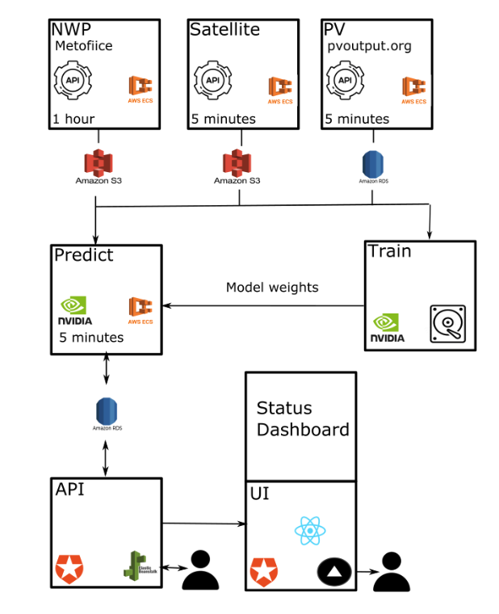
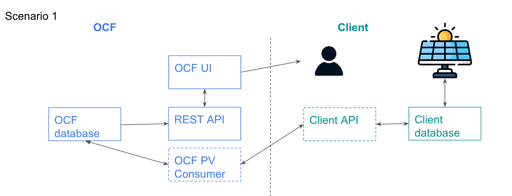
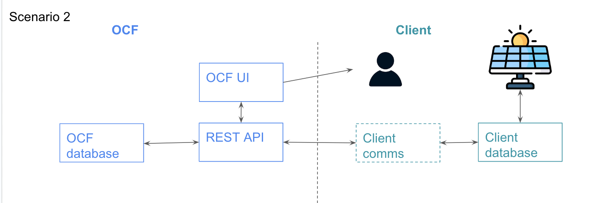
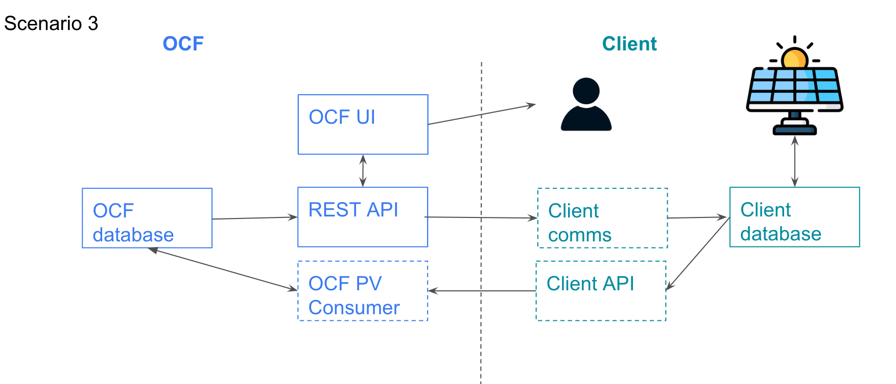

# PVSite Infrastructure

Contains all the infrastructure as code for the pvsite domain.

## Folder structure

The subfolders specify the two environments for the nowcasting domain:

```yaml
pvsite:
  development: # This is for development purposes, eg trying new things out. It is not meant to be up 100% of the time.
  production: # The production environment
```

## Environment Architecture



There are several components to the system:
### ☁️ NWP: 
Gets the latest NWP data from the UK Met Office and saves the data to S3. This is run on ECS and is triggered by airflow. This is currently part of the `nowcasting` project. There are currently two different orders. 
- The first gets data for the next 12 hours with the following variables: `dlwrf`, `dswrf`, `hcc`, `lcc`, `mcc`, `prate`, `r`, `sde`, `si10`, `t`, `vis` .
- The second gets data for the next 42 hours with the following variables:  `dswrf` `lcc` `sde` `t` `wdir10`

More details:
   - code: [nwp-consumer](https://github.com/openclimatefix/nwp-consumer)
   - [Terraform](https://github.com/openclimatefix/ocf-infrastructure/tree/main/terraform/modules/services/nwp) 
and [Airflow Dag](https://github.com/openclimatefix/ocf-infrastructure/blob/main/terraform/modules/services/airflow/dags/nwp-dag.py)
   - AWS logs: [aws/ecs/consumer/nwp](https://eu-west-1.console.aws.amazon.com/cloudwatch/home?region=eu-west-1#logsV2:log-groups/log-group/$252Faws$252Fecs$252Fconsumer$252Fnwp$252F) 
and [aws/ecs/consumer/nwp-national](https://eu-west-1.console.aws.amazon.com/cloudwatch/home?region=eu-west-1#logsV2:log-groups/log-group/$252Faws$252Fecs$252Fconsumer$252Fnwp-national$252F) 
### 🌍  Satellite: 
Gets the latest satellite data from the EUMETSAT and saves the data to S3. This is run on ECS and is triggered by airflow. This is currently part of the `nowcasting` project.
   - code: [Satip](https://github.com/openclimatefix/Satip)
   - [Terraform](https://github.com/openclimatefix/ocf-infrastructure/tree/main/terraform/modules/services/sat) 
  and [Airflow Dag](https://github.com/openclimatefix/ocf-infrastructure/blob/main/terraform/modules/services/airflow/dags/satellite-dag.py)
  - AWS logs: [aws/ecs/consumer/sat](https://eu-west-1.console.aws.amazon.com/cloudwatch/home?region=eu-west-1#logsV2:log-groups/log-group/$252Faws$252Fecs$252Fconsumer$252Fsat$252F) 
### ☀️ PV: 
Gets the latest PV data from the Sheffield Solar API and save to the database. This is run on ECS and is triggered by airflow. This is currently part of the `nowcasting` project. 
   - code: [PVConsumer](https://github.com/openclimatefix/PVConsumer)
   - [Terraform](https://github.com/openclimatefix/ocf-infrastructure/tree/main/terraform/modules/services/pv)
and [Airflow Dag](https://github.com/openclimatefix/ocf-infrastructure/blob/main/terraform/modules/services/airflow/dags/pv-dag.py)
   - AWS logs: [aws/ecs/consumer/pv](https://eu-west-1.console.aws.amazon.com/cloudwatch/home?region=eu-west-1#logsV2:log-groups/log-group/$252Faws$252Fecs$252Fconsumer$252Fpv$252F) 
### 📈 Forecast Prediction: 
Loads NWP and PV data, and then runs the forecast model. The results are saved to the database. This is run on ECS and is triggered by airflow.
   - code: [pv-site-production](https://github.com/openclimatefix/pv-site-production)
   - [Terraform](https://github.com/openclimatefix/ocf-infrastructure/tree/main/terraform/modules/services/forecast_generic) 
and [Airflow Dag](https://github.com/openclimatefix/ocf-infrastructure/blob/main/terraform/modules/services/airflow/dags/forecast-site-dag.py)
   - AWS logs: [aws/ecs/pvsite_forecast/](https://eu-west-1.console.aws.amazon.com/cloudwatch/home?region=eu-west-1#logsV2:log-groups/log-group/$252Faws$252Fecs$252Fpvsite_forecast$252F)
### 🚀  API: 
The API loads forecasts and true values from the database and present the data in an easy to read way. This is run on Elastic Beantstalk. We use Auth0 to authenticate this API.
   - code: [pv-site-api](https://github.com/openclimatefix/pv-site-api)
   - [Terraform](https://github.com/openclimatefix/ocf-infrastructure/tree/main/terraform/modules/services/api_site) 
   - [AWS logs](https://eu-west-1.console.aws.amazon.com/cloudwatch/home?region=eu-west-1#logsV2:log-groups/log-group/$252Faws$252Felasticbeanstalk$252Fpvsite-production-api-sites$252Fvar$252Flog$252Feb-docker$252Fcontainers$252Feb-current-app$252Fstdouterr.log)
### 🔲 UI: 
The UI is a simple React app that displays the data from the API. This is run using Vercel. We use Auth0 to authenticate this UI. This is the same UI used for the `nowcasting` project.
   - [React code](https://github.com/openclimatefix/nowcasting) 
   - logs: Sential - TODO

### Other components:
- Database: We have a postgres database that stores the PV and forecast data. This is run on RDS.
   - [Terraform](https://github.com/openclimatefix/ocf-infrastructure/tree/main/terraform/modules/storage/postgres) 
- Database clean up: Once a day we run a service to remove any data that is more than ~3 days old. 
   - [Python Code](https://github.com/openclimatefix/pv-site-production/tree/main/database-cleanup)
   - [Terraform](https://github.com/openclimatefix/ocf-infrastructure/tree/main/terraform/modules/services/database_clean_up) 
 and [Airflow Dag](https://github.com/openclimatefix/ocf-infrastructure/blob/main/terraform/modules/services/airflow/dags/forecast-site-dag.py#L49)
- Airflow is used to trigger the ECS tasks. They use the latest ECS Task definition. This is part of the [ocf airflow project](https://github.com/openclimatefix/ocf-infrastructure/tree/main/terraform/airflow). 
- OCF Dashboard: This is use for internally looking at the forecasts. Also for managing `sites` and `users`. 


The forecast is trained offline and the model weights are saved to s3. [Python Code](https://github.com/openclimatefix/pv-site-prediction)

## Clients

Client may want to send live PV data in order to make their forecasts better. Here are two different ways this can be done





In Scenario 1, the client sends the live PV data via our API. 
In Scenario 2, the client builds a API and OCF pulls the data from their.
Scenario 3, is a mixture of of Scenario 1 and 2. 

[Private link to images](https://docs.google.com/presentation/d/1mm5JAaNpulQoekZuynDZUmk4pf1osQPp-LdXsuPpghU/edit#slide=id.p)

## Using Terraform

To setup the project:

```bash
$ cd terraform/pvsite/development
$ terraform init
```

To push changes:

```bash
$ terraform plan
$ terraform apply
```

You can then destroy the stack:

```bash
$ terraform destroy
```

## Check List

Out of date - TODO needs updating

- [ ] Is there a [VPC](https://eu-west-1.console.aws.amazon.com/vpc/home?region=eu-west-1#vpcs:)?
- [ ] Has the [RDS](https://eu-west-1.console.aws.amazon.com/rds/home?region=eu-west-1#) database started up?
- [ ] Has the API [Elastic Beanstalk ](https://eu-west-1.console.aws.amazon.com/elasticbeanstalk/home?region=eu-west-1#/environments) service started?
- [ ] Is there an [ECS](https://eu-west-1.console.aws.amazon.com/ecs/home?region=eu-west-1#/clusters) cluster?
- [ ] Is there an [S3](https://s3.console.aws.amazon.com/s3/home?region=eu-west-2) bucket for the NWPs, i.e `nowcasting-nwp-development`
- [ ] After 5 minutes: Did the forecast task run ok? Check in [cloudwatch](https://eu-west-1.console.aws.amazon.com/cloudwatch/home?region=eu-west-1#logsV2:log-groups/)
      or in database insights in [RDS](https://eu-west-1.console.aws.amazon.com/rds/home?region=eu-west-1#)
